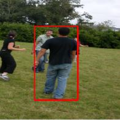
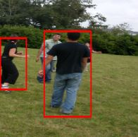
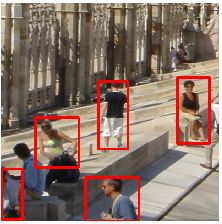
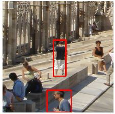
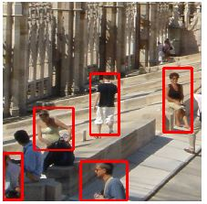

# Keras-Yolo-v2
A very basic re-implementation of Yolo v2 in Keras.
Both normal and tiny backbone models can be used. 

### Links to necessary weight files:
- [Tiny Yolo v2](https://pjreddie.com/media/files/yolov2-tiny-voc.weights)
- [Yolo v2](https://pjreddie.com/media/files/yolov2-voc.weights)

# Usage

### Loading the model:
```py
from tiny_yolo_v2 import TinyYOLOv2
# or from yolo_v2 import YOLOv2

IM_SIZE = 13*32
B = 5
n_classes = 20

net = TinyYOLOv2(IM_SIZE, B, n_classes)
net.loadWeightsFromDarknet(tiny_yolo_darknet_weight_file)
```
## Inference:
Output bounding boxes are in [left, top, right, bottom] format. The origin is at the top-left corner of the image. 

The forward function expects an array of dimensions `[None, IM_SIZE, IM_SIZE, 3]` or `[IM_SIZE, IM_SIZE, 3]`. 

- Regardless of the input, `results` is a list of tuples of length the number of images. 
- Each tuple contains a list of bounding boxes and a list of integer labels, where each label pairs up with a bounding box
```py
resized_image = resize(image, (IM_SIZE, IM_SIZE))
results = net.forward(resized_image)
```

## Once loaded from darknet files, weights can be saved to keras format:
```py
net.m.save(desired_keras_save_path)
```

## Then the models can be loaded without interacting with the darknet files:
(This is also quite a bit faster than the other method)
```py
from tiny_yolo_v2 import TinyYOLOv2
# or from yolo_v2 import YOLOv2

IM_SIZE = 13*32
B = 5
n_classes = 20

net = TinyYOLOv2(IM_SIZE, B, n_classes)
net.loadWeightsFromKeras(tiny_yolo_keras_weight_file)
```

# Example:

Ground Truth                         |  Detected Objects
:-----------------------------------:|:-------------------------:
 | 

(As we can see, the INRIA dataset annotations are pretty bad. In this case, the model detects an unannotated object)

# Training Example

### Create Model
```py
from tiny_yolo_v2 import TinyYOLOv2

trainnet = TinyYOLOv2(13 * 32, 5, 20, is_learning_phase=True)
```

### Create custom yolov2 loss and compile the underlying keras model
```py
from tiny_yolo_v2 import TINY_YOLOV2_ANCHOR_PRIORS as priors
from keras.optimizers import Adam
from yolov2_train import YoloLossKeras

loss = YoloLossKeras(priors).loss
trainnet.m.compile(optimizer=Adam(lr=1e-4), loss=loss, metrics=None)
```

### Fit model
`bounding_boxes` is a list of `(x1, y1, x2, y2)`, while labels is a list of one-hot vectors.
`y_true` is a numpy array of same dimensionality as the network's output, containing all the necessary information to compute the yolov2 loss.
```py
from yolo_v2 import YOLOV2_ANCHOR_PRIORS as priors
from yolov2_train import processGroundTruth

image = imread(image_path)
bounding_boxes, labels = fetch_bounding_boxes_and_labels()

y_true = processGroundTruth(boxes, labels, priors, (13, 13, 5, 25))
trainnet.m.fit(image[None], y_true[None], steps_per_epoch=30, epochs=10)
```

# Overfitting on a single example (starting from random weights)


Ground Truth                  |  After a couple steps     | After more steps
:----------------------------:|:-------------------------:|:----------------:
  | |


Seems like we can overfit quite well! (the bounding boxes on the right-most image are in fact different to the ones in the left-most image)

# Yolov3

This repository also contains an implementation of Yolov3. The architecture has multiple outputs and hence the existing weight loading code does not work as it relies on the (poor) assumption that the keras layers are ordered in a certain way. I have worked around this by implementing darknet config parsing in `cfgparser.load_from_darknet_cfg`. Note that this config parsing has for now only been tested to be working on Yolov3. A static implementation of Yolov3 can also be found in `yolo_v3.py`. The following steps show how to use all of this:

- The following code will simultaneously parse and read the darknet config and weight files, where `m` is a standard keras model:

```py
from cfgparser import load_from_darknet_cfg

cfg_path = 'yolov3.cfg'
weight_file = 'yolov3.weights'

m = load_from_darknet_cfg(cfg_path, weight_file=weight_file)
m.save('yolov3_keras_model')
```

- The static implementation of Yolov3 found in `yolo_v3.py` can be used alongside the previously saved keras weights:

```py
from yolo_v3 import YOLOv3

net = YOLOv3(13 * 32, 9, 80)
net.loadWeightsFromKeras('yolov3_keras_model')
```

Limitations:
- This implementation of Yolov3 is not pure Keras as it relies on using `tf.resize_images` with `align_corners=True`, hence the standard Keras `UpSampling2D` layer cannot be used.

# Todo:
- [ ] Adapt loss function to work with the multiple outputs of Yolov3
- [ ] unify data loading between the different yolo versions
- [ ] stop ignoring the hyperparameters present in the config
- [ ] Implement the necessary infrastructure to use models pretrained on ImageNet


# Documentation:

- [Yolo v1](https://arxiv.org/pdf/1506.02640.pdf)
- [Yolo v2 / 9000](https://arxiv.org/pdf/1612.08242.pdf)
- [Yolo v3](https://pjreddie.com/media/files/papers/YOLOv3.pdf)